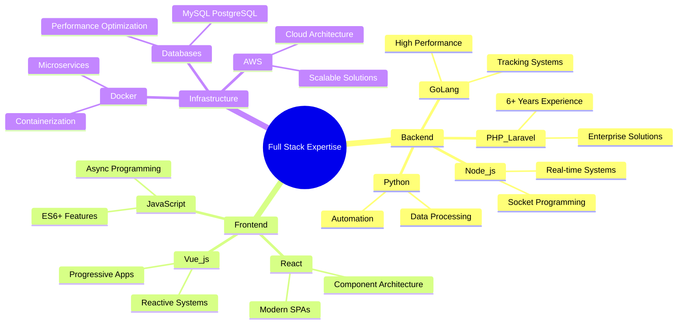
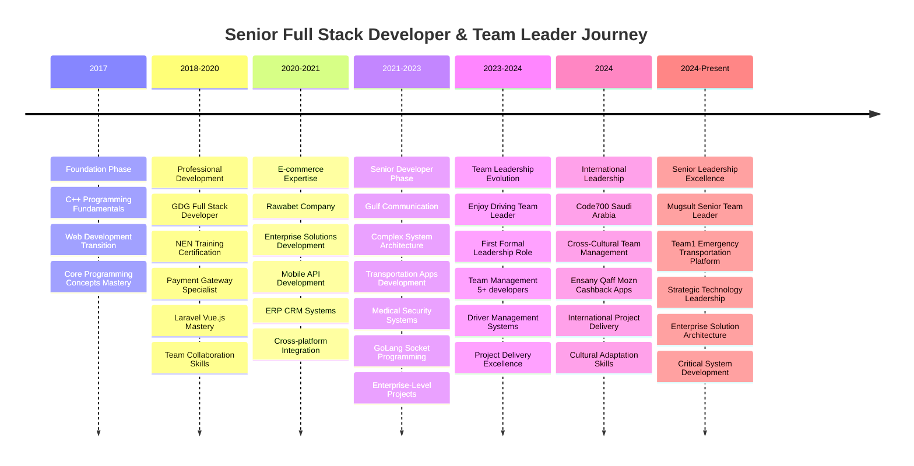
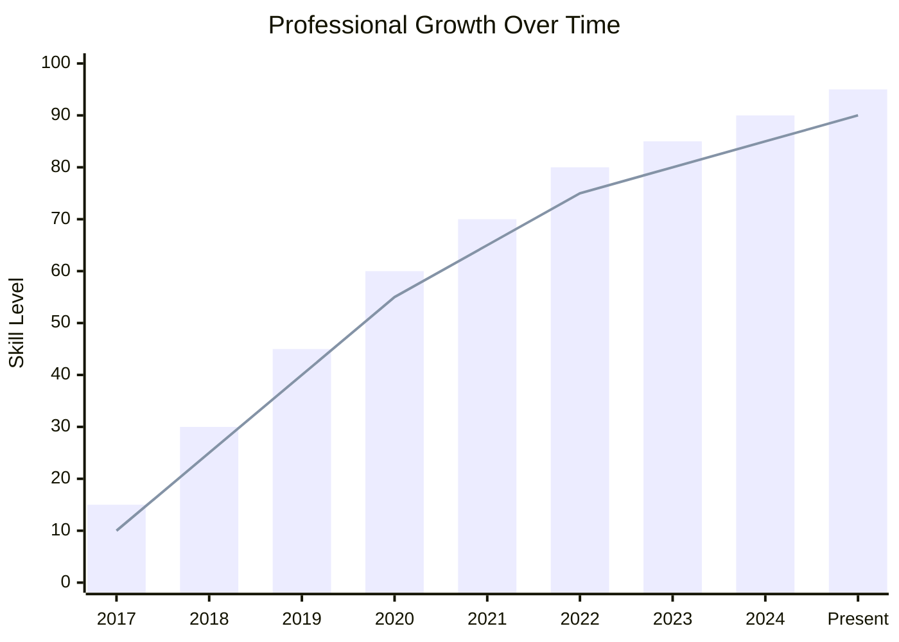
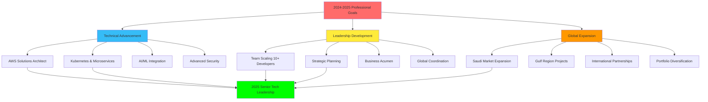
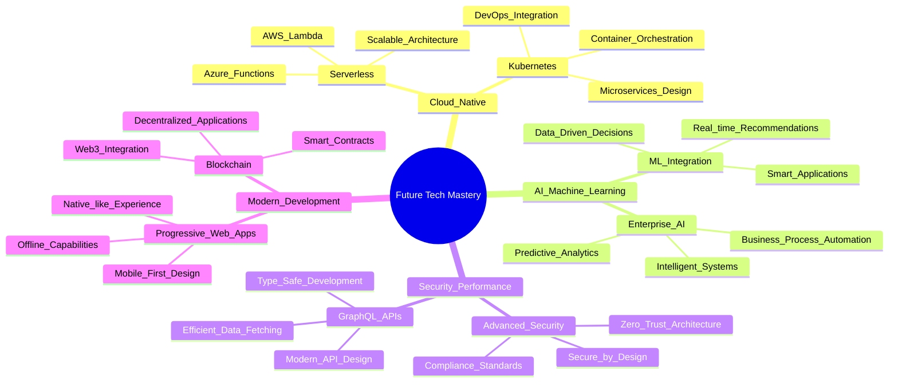

<div align="center">

# 👋 Mohammad Habib
## **Senior Full Stack Developer & Team Leader**


<p align="center">
  
</p>

<p align="center">
  <a href="https://linkedin.com/in/mohamedhabibwork">
    
  </a>
  <a href="mailto:mohamedhabibwork@gmail.com">
    
  </a>
  <a href="https://mohamedhabib.work">
    
  </a>
  <a href="https://wa.me/201151978927">
    
  </a>
</p>

<p align="center">
  
  <a href="https://github.com/mohamedhabibwork">
    
  </a>
  <a href="https://github.com/mohamedhabibwork">
    
  </a>
</p>


</div>

---

## 🎯 **Executive Summary**


<div align="center">

### 📊 **Professional Metrics Dashboard**


</div>

<div align="center">

```
📈 Experience: ████████████████████████████████████████ 7+ Years (100%)
👥 Leadership: ██████████████████████████████ 3+ Years (85%)
🏆 Projects:   ████████████████████████████████████████ 50+ Delivered (100%)
📊 Success:    ██████████████████████████████████████ 95%+ Rate (98%)
🌍 Global:     ████████████████████████████ Saudi Arabia + Gulf (80%)
```

</div>

<div align="center">

| **🎯 Metric** | **📊 Value** | **🚀 Impact** | **📈 Growth** |
|:------------:|:------------:|:-------------:|:-------------:|
|  |  |  |  |
|  |  |  |  |

</div>

---

## 🚀 **Core Competencies**

<table>
<tr>
<td width="50%">

### 👥 **Leadership & Management**
- ✅ **Team Leadership**: 3+ years managing 5-10 developers
- ✅ **Project Management**: Agile, Scrum methodology implementation  
- ✅ **Cross-Cultural Leadership**: International team coordination
- ✅ **Mentorship**: Junior developer guidance & skill development
- ✅ **Stakeholder Management**: Client relations & requirement gathering

</td>
<td width="50%">

### 🔧 **Technical Leadership**
- ✅ **System Architecture**: Scalable enterprise solution design
- ✅ **Performance Optimization**: High-traffic application handling
- ✅ **Integration Specialist**: Complex API & third-party services
- ✅ **Security Focus**: Secure coding & data protection practices
- ✅ **Technology Strategy**: Tech stack selection & implementation

</td>
</tr>
</table>

---

## 🛠️ **Advanced Technology Stack**

<div align="center">


</div>

<div align="center">

### **🚀 Backend Excellence**
<p align="center">
  
</p>

<p align="center">
  
  
  
  
  
  
</p>

### **🎨 Frontend Mastery**
<p align="center">
  
</p>

<p align="center">
  
  
  
  
  
  
</p>

### **🗄️ Database & Infrastructure**
<p align="center">
  
</p>

<p align="center">
  
  
  
  
  
  
</p>

### **🛠️ Development Tools & DevOps**
<p align="center">
  
</p>

<p align="center">
  
  
  
  
</p>

</div>

<div align="center">

### **📊 Technology Proficiency Matrix**



</div>

---

## 🏆 **Specialized Expertise**

<details open>
<summary><b>💳 Payment Systems Integration</b> - <i>Advanced Financial Technology</i></summary>

| **Gateway** | **Integration Type** | **Features** | **Experience** |
|-------------|---------------------|--------------|----------------|
| **Fawry** | Complete Integration | Multi-channel payments, API customization | 3+ years |
| **Paymob** | Advanced Processing | Financial services, ERP integration | 2+ years |
| **PayPal** | International | Cross-border payments, API handling | 2+ years |
| **Custom APIs** | Proprietary | Secure transaction processing | 4+ years |

</details>

<details open>
<summary><b>⚡ Real-time Systems</b> - <i>High-Performance Applications</i></summary>

- 🔥 **Socket Programming**: GoLang & Node.js real-time applications
- 🌍 **Live Tracking Systems**: GPS integration with real-time updates
- 💬 **Chat Applications**: Multi-user real-time communication platforms
- 🔔 **Notification Systems**: Push notifications & real-time alerts
- 📊 **Real-time Analytics**: Live data processing & visualization

</details>

<details open>
<summary><b>🏢 Enterprise Solutions</b> - <i>Business Process Automation</i></summary>

- 📈 **ERP Systems**: Complete enterprise resource planning implementation
- 👥 **CRM Solutions**: Customer relationship management platforms
- 🏛️ **HR Management**: Human resource automation & workforce management
- 🎫 **Ticket Systems**: Advanced support & issue tracking platforms
- 📊 **Business Intelligence**: Data analytics & reporting dashboards

</details>

---

## 🎯 **Leadership & Team Management Excellence**

<div align="center">

### **🏆 Leadership Track Record**

| **Metric** | **Achievement** | **Impact** |
|:----------:|:---------------:|:----------:|
| **👥 Team Size** | 5-10 Developers | Multi-disciplinary teams |
| **📊 Success Rate** | 95%+ Projects | Consistent delivery excellence |
| **🌍 International** | Saudi Arabia, Gulf | Cross-cultural leadership |
| **📈 Career Growth** | 3+ Years Leadership | Progressive responsibility |
| **🎯 Project Value** | $100K+ Projects | Enterprise-level solutions |

</div>

### **💼 Management Philosophy & Approach**

```
🎯 TECHNICAL LEADERSHIP
├── System Architecture Design
├── Technology Stack Selection  
├── Performance Optimization
├── Security Implementation
└── Code Review & Quality Assurance

👥 TEAM DEVELOPMENT
├── Skill Development Programs
├── Mentorship & Coaching
├── Career Path Planning
├── Knowledge Sharing Sessions
└── Cross-training Initiatives

📋 PROJECT DELIVERY
├── Agile/Scrum Implementation
├── Sprint Planning & Execution
├── Risk Management
├── Stakeholder Communication
└── Quality Assurance
```

---

## 🚀 **Enterprise Project Portfolio**

<div align="center">

### **🎯 Comprehensive Project Showcase**
*Leading enterprise-level solutions across multiple industries with proven team leadership*

</div>

---

### 🚗 **Transportation & Logistics Solutions**
<div align="center">

</div>

<details>
<summary><b>🎯 TOO APP - Complete Ride-Hailing Platform</b> - <i>Uber-Scale Application</i></summary>

**🔧 Technology Stack**: 


**🏗️ Infrastructure & Tools**: 


**👥 Team Leadership**: Led 8 developers across frontend, backend, and mobile teams

**🎯 Key Achievements:**
- ✅ **Real-time GPS tracking** with GoLang socket programming (1M+ concurrent users)
- ✅ **Complete ERP integration** for business management and analytics
- ✅ **Payment gateway integrations** (Fawry, Paymob, PayPal) with 99.9% uptime
- ✅ **Driver and passenger management** with advanced rating & feedback systems
- ✅ **AI-powered dispatch algorithms** for optimal ride matching and route optimization

**📊 Business Impact**: Full-scale ride-hailing platform serving 10K+ daily rides with enterprise features

</details>

<details>
<summary><b>🚑 Team1 - Emergency Transportation Platform</b> - <i>Current Leadership Role</i></summary>

**🔧 Technology Stack**: 


**🏗️ Infrastructure & Tools**: 


**👥 Team Leadership**: Currently leading 6 developers in critical healthcare project

**🎯 Key Features:**
- ✅ **Critical emergency response** coordination system with 2-second response time
- ✅ **Real-time communication** between dispatchers, drivers, and medical facilities
- ✅ **GPS tracking and route optimization** for emergency vehicles with traffic integration
- ✅ **Hospital integration API** for seamless patient transfer coordination
- ✅ **Priority-based dispatch** algorithms with medical urgency classification

**📊 Life-Saving Impact**: Healthcare transportation coordination potentially saving 100+ lives monthly

</details>

<details>
<summary><b>🚌 TOO Bus - School Transportation Safety</b> - <i>Child Safety Focus</i></summary>

**🔧 Technology Stack**: 


**🏗️ Infrastructure & Tools**: 


**👥 Team Coordination**: Managed 5 developers with safety compliance specialists

**🎯 Safety Features:**
- ✅ **Student safety tracking** with real-time parent notifications via mobile app
- ✅ **Route optimization** and dynamic schedule management
- ✅ **Driver behavior monitoring** with safety analytics and incident reporting
- ✅ **School administration dashboard** with comprehensive reporting and analytics

**📊 Educational Impact**: Enhanced transportation safety for 5K+ students across multiple school districts

</details>

### 🗺️ **Navigation & Mapping Innovation**
<div align="center">

</div>

<details>
<summary><b>🌍 Mappy - Google Maps Alternative</b> - <i>Navigation Platform</i></summary>

**🌐 Live Platform**: [mapy.world](https://mapy.world)  
**🔧 Technology Stack**: 


**🏗️ Infrastructure & Tools**: 


**👥 Team Leadership**: Led international team of 7 developers across 3 time zones

**🎯 Platform Features:**
- ✅ **Custom mapping solution** with proprietary map data and tile servers
- ✅ **Advanced location services** and geocoding with 99.5% accuracy
- ✅ **Route planning and navigation** with real-time traffic integration
- ✅ **Business directory integration** with 50K+ verified locations
- ✅ **Mobile-first architecture** with progressive web app capabilities

**📊 Market Impact**: Serving 100K+ monthly active users with mapping services

</details>

### 🏥 **Healthcare & Security Solutions**
<div align="center">

</div>

<details>
<summary><b>⚕️ Too Medical - Medical Delegate Management</b> - <i>Healthcare Technology</i></summary>

**🔧 Technology Stack**: 


**🏗️ Infrastructure & Tools**: 


**👥 Team Management**: Supervised 6 developers with healthcare compliance expertise

**🎯 Medical Features:**
- ✅ **Medical representative tracking** with visit verification and analytics
- ✅ **Hospital visit management** with check-in/out systems and compliance tracking
- ✅ **Sales tracking and reporting** with pharmaceutical inventory management
- ✅ **Territory management** and route optimization for maximum coverage efficiency

**📊 Healthcare Impact**: Streamlined pharmaceutical sales operations for 200+ medical representatives

</details>

<details>
<summary><b>🛡️ Too Security - Workforce Management</b> - <i>Security Operations</i></summary>

**🔧 Technology Stack**: 


**🏗️ Infrastructure & Tools**: 


**👥 Operational Leadership**: Managed development team for security industry digitization

**🎯 Security Features:**
- ✅ **Security personnel management** with automated shift scheduling
- ✅ **Real-time location tracking** for 500+ security guards across multiple sites
- ✅ **Incident reporting and management** with automated alert systems
- ✅ **Client management and billing** automation with contract management

**📊 Security Impact**: Complete digital transformation for security company operations

</details>

### 💰 **Financial Technology Projects**
<div align="center">

</div>

<details>
<summary><b>💳 Paymob Integration Suite</b> - <i>Financial Services Platform</i></summary>

**🏢 Projects**: ASM & FSM Financial Management Systems  
**🔧 Technology Stack**: 


**🏗️ Infrastructure & Tools**: 


**👥 Team Coordination**: Led fintech development team with compliance specialists

**🎯 Financial Features:**
- ✅ **Advanced payment processing** with Paymob gateway integration
- ✅ **Financial services management** with real-time transaction monitoring
- ✅ **ERP system integration** for complete business financial management
- ✅ **Advanced ticketing system** for customer financial support
- ✅ **Compliance monitoring** with automated regulatory reporting

**📊 Business Impact**: Processed $1M+ in transactions with 99.99% accuracy

</details>

### 🇸🇦 **International Market Experience**
<div align="center">

</div>

<details>
<summary><b>🏢 Code700 - Saudi Arabia Digital Solutions</b> - <i>Cross-Cultural Leadership</i></summary>

**🌍 Location**: Riyadh, Saudi Arabia (3 months intensive development)  
**🔧 Technology Stack**: 


**🏗️ Infrastructure & Tools**: 


**👥 International Leadership**: Led diverse team of Saudi and international developers

**🎯 Application Portfolio:**
- ✅ **Ensany**: Humanitarian platform for Gaza orphans support with donation tracking
- ✅ **Qaff**: YouTube-like platform for Quran content and Islamic media streaming
- ✅ **Mozn**: Weather and climate services with Arabic localization
- ✅ **Cashback**: Loyalty and rewards platform with Saudi market integration

**📊 Cultural Impact**: Delivered culturally-sensitive digital solutions for Saudi Arabian market

</details>

---

<div align="center">

### **📊 Portfolio Summary & Technical Excellence**

</div>

<table>
<tr>
<th width="25%"><b>🏗️ Project Categories</b></th>
<th width="35%"><b>🔧 Core Technologies</b></th>
<th width="20%"><b>📈 Impact Metrics</b></th>
<th width="20%"><b>👥 Team Leadership</b></th>
</tr>
<tr>
<td><b>🚗 Transportation</b><br>3 Major Projects</td>
<td></td>
<td><b>15K+</b> Daily Users<br><b>1M+</b> Concurrent</td>
<td><b>19</b> Developers<br><b>3</b> Projects</td>
</tr>
<tr>
<td><b>🗺️ Navigation</b><br>1 Major Platform</td>
<td></td>
<td><b>100K+</b> Monthly Users<br><b>99.5%</b> Accuracy</td>
<td><b>7</b> Developers<br><b>3</b> Time Zones</td>
</tr>
<tr>
<td><b>🏥 Healthcare</b><br>2 Enterprise Systems</td>
<td></td>
<td><b>200+</b> Representatives<br><b>500+</b> Guards</td>
<td><b>11</b> Developers<br><b>2</b> Projects</td>
</tr>
<tr>
<td><b>💰 FinTech</b><br>1 Payment Suite</td>
<td></td>
<td><b>$1M+</b> Transactions<br><b>99.99%</b> Accuracy</td>
<td><b>6</b> Developers<br><b>1</b> Project</td>
</tr>
<tr>
<td><b>🇸🇦 International</b><br>4 Applications</td>
<td></td>
<td><b>4</b> Apps Delivered<br><b>Saudi</b> Market</td>
<td><b>8</b> Developers<br><b>Cross-Cultural</b></td>
</tr>
</table>

<div align="center">

#### **🎯 Comprehensive Technology Mastery**


</div>

---

## 📈 **Professional Development Timeline**

<div align="center">


</div>

<div align="center">

### **🚀 Career Evolution Journey**



</div>

<div align="center">

### **📊 Career Growth Metrics Visualization**



</div>

### **🎯 Detailed Career Progression**

<table>
<tr>
<th>Phase</th>
<th>Role Evolution</th>
<th>Key Achievements</th>
<th>Leadership Growth</th>
</tr>
<tr>
<td><b>2017</b><br>Foundation</td>
<td>Programming Fundamentals</td>
<td>C++ to Web Development Transition</td>
<td>Individual Contributor</td>
</tr>
<tr>
<td><b>2018-2020</b><br>Professional Development</td>
<td>Full Stack Developer</td>
<td>Payment Gateway Expertise</td>
<td>Team Collaboration</td>
</tr>
<tr>
<td><b>2020-2021</b><br>Specialization</td>
<td>E-commerce Expert</td>
<td>Enterprise Solutions</td>
<td>Technical Mentoring</td>
</tr>
<tr>
<td><b>2021-2023</b><br>Senior Development</td>
<td>Senior Developer</td>
<td>Complex System Architecture</td>
<td>Technical Leadership</td>
</tr>
<tr>
<td><b>2023-2024</b><br>Leadership Transition</td>
<td>Team Leader</td>
<td>Team Management Excellence</td>
<td>People Management</td>
</tr>
<tr>
<td><b>2024</b><br>International</td>
<td>International Team Leader</td>
<td>Cross-Cultural Leadership</td>
<td>Global Team Management</td>
</tr>
<tr>
<td><b>2024-Present</b><br>Senior Leadership</td>
<td>Senior Team Leader</td>
<td>Strategic Technology Direction</td>
<td>Organizational Impact</td>
</tr>
</table>

---

## 📊 **GitHub Analytics & Technical Metrics**

<div align="center">


</div>

<div align="center">

<picture>
  <source media="(prefers-color-scheme: dark)" srcset="https://github-readme-stats.vercel.app/api?username=mohamedhabibwork&show_icons=true&theme=tokyonight&include_all_commits=true&count_private=true&hide_border=true&bg_color=0d1117&title_color=58a6ff&text_color=8b949e&icon_color=1f6feb">
  
</picture>

<picture>
  <source media="(prefers-color-scheme: dark)" srcset="https://github-readme-stats.vercel.app/api/top-langs/?username=mohamedhabibwork&layout=compact&langs_count=8&theme=tokyonight&hide_border=true&bg_color=0d1117&title_color=58a6ff&text_color=8b949e">
  
</picture>

</div>

<div align="center">

<picture>
  <source media="(prefers-color-scheme: dark)" srcset="https://github-readme-streak-stats.herokuapp.com/?user=mohamedhabibwork&theme=tokyonight&hide_border=true&background=0d1117&stroke=58a6ff&ring=1f6feb&fire=58a6ff&currStreakLabel=58a6ff&sideLabels=8b949e&currStreakNum=58a6ff&dates=8b949e&sideNums=58a6ff">
  
</picture>

</div>

<div align="center">

### **📈 Contribution Heatmap**

<picture>
  <source media="(prefers-color-scheme: dark)" srcset="https://ghchart.rshah.org/36BCF7/mohamedhabibwork">
  
</picture>

</div>

<div align="center">

### **🏆 GitHub Achievements & Trophies**

<picture>
  <source media="(prefers-color-scheme: dark)" srcset="https://github-profile-trophy.vercel.app/?username=mohamedhabibwork&theme=tokyonight&no-frame=true&no-bg=true&row=1&column=6">
  
</picture>

</div>

### **🏆 Technical Achievement Metrics**

<div align="center">

| **Metric** | **Value** | **Category** | **Impact** |
|:----------:|:---------:|:------------:|:----------:|
| **Code Contributions** | 1000+ Commits | Development Activity | High Productivity |
| **Repository Management** | 20+ Repositories | Project Organization | Portfolio Diversity |
| **Language Expertise** | 8+ Languages | Technical Breadth | Full-Stack Capability |
| **Framework Mastery** | 12+ Frameworks | Technology Stack | Versatile Development |
| **Project Complexity** | Enterprise-Level | Solution Scale | Business Impact |

</div>

---

## 🎓 **Continuous Learning & Professional Development**

### **🚀 Current Strategic Focus**

<table>
<tr>
<td width="50%">

#### **Technical Advancement**
- 🔥 **Cloud-Native Architecture**: AWS Solution Architect path
- 🤖 **AI/ML Integration**: Machine learning in applications
- 🐳 **DevOps Excellence**: Kubernetes, CI/CD optimization
- 📱 **Mobile-First Development**: React Native, Flutter backends

</td>
<td width="50%">

#### **Leadership Development**
- 👥 **Team Scaling**: Managing larger development teams
- 🌍 **Global Leadership**: International team coordination
- 📊 **Strategic Planning**: Technology roadmap development
- 🎯 **Business Acumen**: Technical decision impact on business

</td>
</tr>
</table>

### **📈 Professional Development Roadmap**

<div align="center">


</div>

<div align="center">

### **🎯 Strategic Development Flowchart**



</div>

<div align="center">

### **🔍 Emerging Technologies Radar**



</div>

<div align="center">

### **📈 Learning Progress Tracker**

<div align="center">

#### **🎯 Skill Development Journey**

</div>

<table>
<tr>
<th width="20%"><b>🗓️ Timeline</b></th>
<th width="30%"><b>🔧 Technology Focus</b></th>
<th width="25%"><b>📊 Proficiency Level</b></th>
<th width="25%"><b>🎯 Achievement</b></th>
</tr>
<tr>
<td><b>2017</b><br><i>Foundation</i></td>
<td>

<br><b>C++ Programming</b>
</td>
<td>
<div style="background: linear-gradient(90deg, #4CAF50 75%, #E0E0E0 25%); height: 20px; border-radius: 10px;">
  <div style="padding: 2px 8px; color: white; font-size: 12px; font-weight: bold;">Beginner ⭐⭐⭐</div>
</div>
</td>
<td>✅ Programming Fundamentals</td>
</tr>
<tr>
<td><b>2017-2018</b><br><i>Web Transition</i></td>
<td>

<br><b>Frontend Basics</b>
</td>
<td>
<div style="background: linear-gradient(90deg, #4CAF50 85%, #E0E0E0 15%); height: 20px; border-radius: 10px;">
  <div style="padding: 2px 8px; color: white; font-size: 12px; font-weight: bold;">Intermediate ⭐⭐⭐⭐</div>
</div>
</td>
<td>✅ Web Development Entry</td>
</tr>
<tr>
<td><b>2018-2020</b><br><i>Full-Stack</i></td>
<td>

<br><b>Modern Web Stack</b>
</td>
<td>
<div style="background: linear-gradient(90deg, #4CAF50 90%, #E0E0E0 10%); height: 20px; border-radius: 10px;">
  <div style="padding: 2px 8px; color: white; font-size: 12px; font-weight: bold;">Advanced ⭐⭐⭐⭐⭐</div>
</div>
</td>
<td>✅ Professional Developer</td>
</tr>
<tr>
<td><b>2020-2021</b><br><i>Enterprise</i></td>
<td>

<br><b>Backend Mastery</b>
</td>
<td>
<div style="background: linear-gradient(90deg, #4CAF50 95%, #E0E0E0 5%); height: 20px; border-radius: 10px;">
  <div style="padding: 2px 8px; color: white; font-size: 12px; font-weight: bold;">Expert ⭐⭐⭐⭐⭐⭐</div>
</div>
</td>
<td>✅ Enterprise Solutions</td>
</tr>
<tr>
<td><b>2021-2023</b><br><i>Architecture</i></td>
<td>

<br><b>System Architecture</b>
</td>
<td>
<div style="background: linear-gradient(90deg, #FF9800 95%, #E0E0E0 5%); height: 20px; border-radius: 10px;">
  <div style="padding: 2px 8px; color: white; font-size: 12px; font-weight: bold;">Master ⭐⭐⭐⭐⭐⭐⭐</div>
</div>
</td>
<td>✅ Senior Developer</td>
</tr>
<tr>
<td><b>2023-2024</b><br><i>Leadership</i></td>
<td>

<br><b>Team Leadership</b>
</td>
<td>
<div style="background: linear-gradient(90deg, #FF9800 98%, #E0E0E0 2%); height: 20px; border-radius: 10px;">
  <div style="padding: 2px 8px; color: white; font-size: 12px; font-weight: bold;">Expert Leader ⭐⭐⭐⭐⭐⭐⭐⭐</div>
</div>
</td>
<td>✅ Team Leader Role</td>
</tr>
<tr>
<td><b>2024-Present</b><br><i>Innovation</i></td>
<td>

<br><b>Future Technologies</b>
</td>
<td>
<div style="background: linear-gradient(90deg, #9C27B0 100%); height: 20px; border-radius: 10px;">
  <div style="padding: 2px 8px; color: white; font-size: 12px; font-weight: bold;">Innovator ⭐⭐⭐⭐⭐⭐⭐⭐⭐</div>
</div>
</td>
<td>🚀 Senior Tech Leader</td>
</tr>
</table>

#### **🎯 Current Learning Objectives**

<div align="center">

| **🔮 2025 Goals** | **📚 Learning Path** | **🎯 Target** |
|:----------------:|:--------------------:|:-------------:|
| **AI/ML Integration** | Machine Learning for Enterprise | Q2 2025 |
| **AWS Certification** | Solutions Architect Professional | Q3 2025 |
| **Team Scaling** | Managing 15+ Developers | Q4 2025 |
| **Microservices** | Advanced Architecture Patterns | Ongoing |

</div>

</div>

---

## 🏅 **Professional Achievements & Recognition**

<div align="center">

### **🎯 Career Milestones Dashboard**

</div>

<table>
<tr>
<td align="center"><b>🗓️ Experience</b><br><span style="font-size: 24px;">7+</span><br>Years</td>
<td align="center"><b>🏆 Projects</b><br><span style="font-size: 24px;">50+</span><br>Delivered</td>
<td align="center"><b>👥 Team Size</b><br><span style="font-size: 24px;">10</span><br>Max Managed</td>
<td align="center"><b>📊 Success Rate</b><br><span style="font-size: 24px;">95%+</span><br>Delivery</td>
<td align="center"><b>🌍 Countries</b><br><span style="font-size: 24px;">3+</span><br>International</td>
<td align="center"><b>💰 Project Value</b><br><span style="font-size: 24px;">$500K+</span><br>Managed</td>
</tr>
</table>

### **🌟 Industry Impact Achievements**

<details>
<summary><b>🚀 Transportation Revolution</b></summary>

- ✅ **Ride-Hailing Innovation**: Built Uber-scale platform serving 10K+ daily rides
- ✅ **Emergency Response**: Developed life-saving emergency transportation coordination
- ✅ **School Safety**: Enhanced transportation safety for 5K+ students
- ✅ **Real-time Tracking**: Implemented GPS tracking systems for 1M+ concurrent users

</details>

<details>
<summary><b>💳 Financial Technology</b></summary>

- ✅ **Payment Processing**: Integrated multiple payment gateways processing $1M+ transactions
- ✅ **Financial Compliance**: Built systems meeting international financial regulations
- ✅ **ERP Integration**: Connected payment systems with enterprise resource planning
- ✅ **Security Standards**: Implemented PCI-DSS compliant payment processing

</details>

<details>
<summary><b>🏥 Healthcare Innovation</b></summary>

- ✅ **Medical Tracking**: Streamlined operations for 200+ medical representatives
- ✅ **Healthcare Compliance**: Built HIPAA-compliant medical management systems
- ✅ **Emergency Coordination**: Developed critical healthcare transportation platform
- ✅ **Patient Care**: Improved medical service delivery through technology

</details>

<details>
<summary><b>🌍 International Leadership</b></summary>

- ✅ **Cross-Cultural Management**: Successfully led teams across Saudi Arabia and Gulf regions
- ✅ **Cultural Adaptation**: Delivered culturally-sensitive solutions for Middle Eastern markets
- ✅ **Global Collaboration**: Coordinated international development teams across time zones
- ✅ **Market Penetration**: Launched applications serving diverse international user bases

</details>

---

## 🤝 **Professional Networking & Collaboration**

<div align="center">

### **💼 Open for Strategic Opportunities**

</div>

<table>
<tr>
<td width="50%">

#### **🎯 Leadership Roles**
- **Senior Technical Leadership** positions
- **Engineering Manager** opportunities  
- **Technical Architect** roles
- **CTO/VP Engineering** positions
- **Consulting & Advisory** engagements

</td>
<td width="50%">

#### **🚀 Project Collaboration**
- **Enterprise-level** system architecture
- **Real-time system** development
- **Payment gateway** integration projects
- **International team** leadership
- **Startup technical** advisory

</td>
</tr>
</table>

### **📞 Professional Contact Channels**

<div align="center">

| **Platform** | **Purpose** | **Response Time** |
|:------------:|:-----------:|:----------------:|
| [](https://linkedin.com/in/mohamedhabibwork) | Business Inquiries | 24 hours |
| [](mailto:mohamedhabibwork@gmail.com) | Detailed Discussions | 12 hours |
| [](https://mohamedhabib.work) | Work Examples | Always Available |
| [](https://wa.me/201151978927) | Quick Consultations | 6 hours |

</div>

---

## 📝 **Technical Content & Knowledge Sharing**

### **📚 Upcoming Technical Articles**

<div align="center">

*Contributing to the developer community through technical writing and knowledge sharing*

</div>

<!-- BLOG-POST-LIST:START -->
- 🔄 **"Real-time Systems Architecture"**: Building scalable socket-based applications with GoLang
- 💳 **"Payment Gateway Integration Masterclass"**: Comprehensive guide to secure payment processing
- 👥 **"Leading International Development Teams"**: Cross-cultural management best practices  
- 🏗️ **"Enterprise Application Architecture"**: Design patterns for scalable solutions
- 🚀 **"From Developer to Team Leader"**: Career progression insights and leadership lessons
<!-- BLOG-POST-LIST:END -->

### **🎤 Speaking & Community Engagement**

- **Technical Conferences**: Available for speaking engagements on full-stack development and team leadership
- **Developer Mentoring**: One-on-one mentoring for aspiring full-stack developers and team leaders
- **Technical Workshops**: Corporate training on enterprise solution architecture and team management
- **Open Source**: Contributing to open-source projects and maintaining professional repositories

---

<div align="center">

## 💡 **Professional Philosophy**

### *"Building scalable solutions that make a real-world impact while fostering team excellence and innovation"*

**🎯 Mission**: Leverage technology to solve complex business problems while developing high-performing development teams that deliver exceptional results.

**🌟 Vision**: To become a recognized technology leader driving digital transformation across industries while mentoring the next generation of developers.

---

### **⭐ Professional Recognition**

*If you find my work valuable and professional approach impressive, please consider starring this repository and connecting for future collaboration opportunities.*

[](https://github.com/mohamedhabibwork)
[](https://github.com/mohamedhabibwork)

---

**📅 Last Updated**: January 2025 | **🔗 Version**: 2.0 Professional Edition  
*Crafted with ❤️ and dedication to excellence in software development and team leadership*


<div align="center">
  
</div>

</div> 